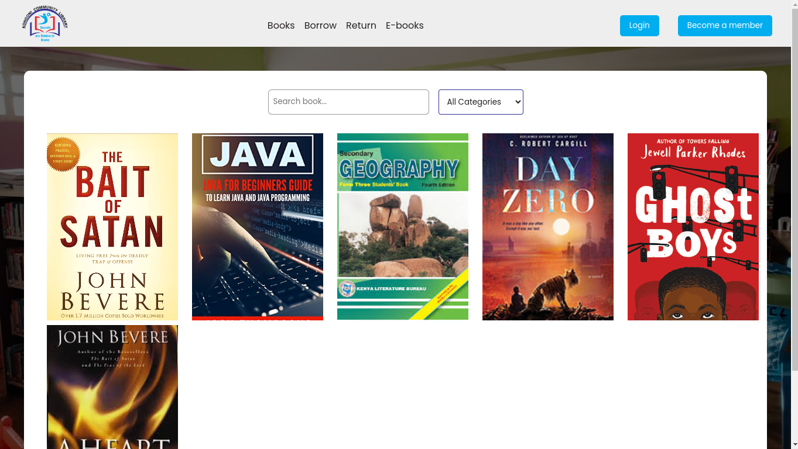

# Library Management System

The following is a library management system made using node js  and template engines. Soo I will be releasing the features since the web app is in development

## Screenshots

## features

### client side
Register as a member
Borrow book and return book
Review books
Read ebooks online

### Admin side
Know your people visiting your library
Get analytics of what time you get most people
Get the books that are mostly borrowed
Track people borrowing books
Add new books by scanning them

